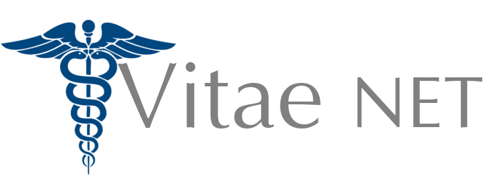

# 

Vitae NET is an educational EHR and medication administration tool intended for
use in simulated environments by student nurses. 

## Dependencies

Vitae NET is a Laravel 5.5 application, and as such requires:

- PHP 7.0 or higher
- OpenSLL PHP extension
- PDO PHP extension
- Mbstring PHP extension
- Tokenizer PHP extension
- XML PHP extension
- GD PHP extension
- JSON PHP extension
- MySQL PHP extension

The [deployment guide](docs/deployment.md) provides information about how to
deploy Vitae NET onto a CentOS server using Nginx as a webserver.

Additionally, to compile the Javascript and SASS assets, NodeJS and NPM are
required.

## Documentation

Additional documentation is provided in the `docs/` directory and the Github
wiki.

## License

Vitae NET is released under the MIT license ( or
).

